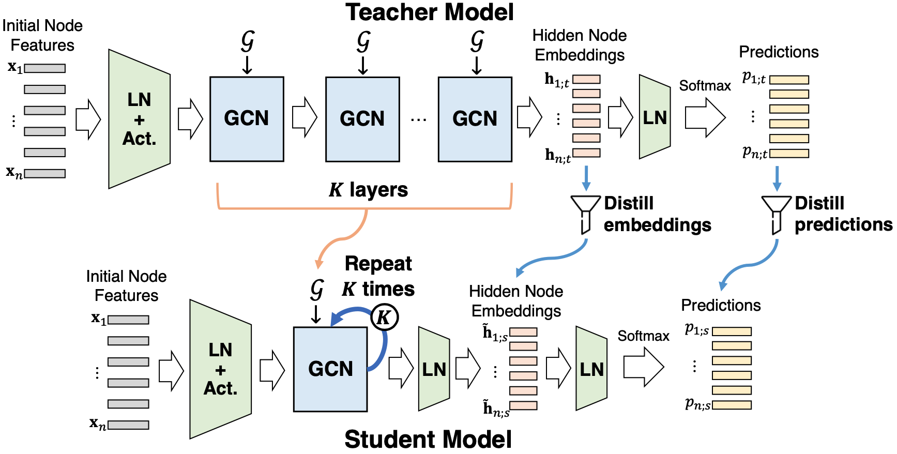

# MuSK

Given a trained deep Graph Convolution Network (GCN), how can we effectively compress it into a compact network without significant loss of accuracy? Though many deep GCN models improved their performance by considering multi-hop features in graphs, it is difficult to use them in environments having limited computing resources such as mobile or embedded systems. Therefore, it is important to compress large GCN models into a compact GCN model. Knowledge Distillation (KD) is an actively pursued area of research to learn a compressed student model from a teacher model. However, existing KD methods do not preserve the multi-hop aggregation of deep GCN models.
We propose MuSK, a novel approach for compressing deep GCNs through distilling the knowledge of the aggregation from multi-staged GCN layers as well as task prediction. MuSK compresses the deep teacher layers without losing the concept of multi-hop feature aggregation process with a single effective layer in the student. Extensive experiments show that MuSK achieves state-of-the-art performance among other KD based methods while requiring up to 11.4× fewer parameters than the teacher.

## Overview

1. **Preserving Multi-hop Feature Aggregation**: MuSK preserves the feature aggregation procedure of deep GCN layers of the teacher in a single effective GCN layer of a student.
2. **Distilling Knowledge from Trained Deep GCNs**: MuSK distills the last hidden embeddings after K-hop aggregations of the teacher into the student. This distillation guides the student to follow the teacher’s behavior more carefully.
3. **Distilling Knowledge of Predictions**: The distillation of task prediction guides the student to obtain similar predictive outputs as the teacher.

## Code Description
- src/citation/model.py: Model architecture of GCNII
- src/citation/process.py: Processing functions used on training
- src/citation/utils.py: Utility functions for GCNII
- src/citation/student_train.py: Trains a student GCNII model
- src/citation/teacher_train.py: Trains a teacher GCNII model
- src/citation/teacher: Pre-trained teacher model path for citation dataset
- src/citation/student: Student model path for citation dataset
- src/ogbn-proteins/model.py: Model architecture of GEN
- src/ogbn-proteins/utils.py: Utility functions for GEN
- src/ogbn-proteins/student_train.py: Trains a student GEN model
- src/ogbn-proteins/teacher_train.py: Trains a teacher GEN model
- src/ogbn-proteins/student: Pre-trained teacher model path for ogbn-proteins
- src/ogbn-proteins/teacher: Student model path for ogbn-proteins


## Citation dataset

### Dependencies
- CUDA 10.1
- python 3.6.8
- pytorch 1.7.0
- torch-geometric 1.6.1

### Datasets
The `data` folder contains three benchmark datasets(Cora, Citeseer, Pubmed)
We use the same semi-supervised setting as [GCN](https://github.com/tkipf/gcn).

### Simple Demo
You can run the demo sript by `bash citation.sh`.
It trains MuSK on Cora, Citetation, and Pubmed.
This demo saves the trained student model at `src/citation/student/student_{DATASET}{#LAYERS}.pt`.
Then, it evaluates the trained model in terms of accuracy. 

#### Used Hyperparameters 
We briefly summarize the hyperparameters.

* Hyperparameters of MuSK
    - `data`: name of the dataset
    - `layer`: number of layers in the teacher
    - `test`: evaluation on test dataset
    - `t_hidden`: teacher's hidden feature dimension
    - `s_hidden`: student's hidden feature dimension
    - `lamda`: lamda in GCNII
    - `dropout`: ratio of dropout
    - `lbd_pred`: lambda for the prediction loss
    - `lbd_embd`: lambda for the embedding loss
    - `kernel`: kernel function

#### Detailed Usage
You can reproduce results with the following command which evaluates a test dataset using a pre-trained model. 
```shell
python -u src/citation/student_train.py --data cora --layer 64 --test --lbd_pred 1 --lbd_embd 0.01 --kernel kl
python -u src/citation/student_train.py --data citeseer --layer 64 --t_hidden 256 --s_hidden 256 --lamda 0.6 --dropout 0.7 --test --lbd_pred 0.1 --lbd_embd 0.01 --kernel kl
python -u src/citation/student_train.py --data pubmed --layer 64 --t_hidden 256 --s_hidden 256 --lamda 0.4 --dropout 0.5 --wd1 5e-4 --test --lbd_pred 100 --lbd_embd 10 --kernel kl
```

The pre-trained teachers were generated by the following command:
```shell
python -u src/citation/teacher_train.py --data cora --layer 64 --test
python -u src/citation/teacher_train.py --data citeseer --layer 64 --hidden 256 --lamda 0.6 --dropout 0.7 --test
python -u src/citation/teacher_train.py --data pubmed --layer 64 --hidden 256 --lamda 0.4 --dropout 0.5 --wd1 5e-4 --test
```

### Reference implementation
Codes are written based on [GCNII](https://github.com/chennnM/GCNII)


## ogbn-proteins dataset

### Dependencies
- CUDA 10.0
- python 3.6.8
- pytorch 1.4.0
- torch-geometric 1.6.0

### Datasets
We use the [ogbn-proteins dataset](https://ogb.stanford.edu/docs/nodeprop/).
When you first run our script, the dataset will be downloaded automatically.

### Simple Demo
You can run the demo sript by `bash ogbn-proteins.sh`.
It trains MuSK on ogbn-proteins.
This demo saves the trained student model at `./src/ogbn-proteins/student/student_{DATASET}{#LAYERS}.pt`.
Then, it evaluates the trained model in terms of ROC-AUC. 

#### Used Hyperparameters 
We briefly summarize the hyperparameters.

* Hyperparameters of MuSK
    - `layer`: number of layers in the teacher
    - `hidden`: student's hidden feature dimension
    - `lbd_pred`: lambda for the prediction loss
    - `lbd_embd`: lambda for the embedding loss
    - `train_bn`: train batch number
    - `test_bn`: test batch number

#### Detailed Usage
You can reproduce results with the following command which evaluates a test dataset using a pre-trained model. 
```shell
python src/ogbn-proteins/teaecher_train.py --lbd_pred 0.1 --lbd_embd 0.01 --hidden 64 --layer 28 --train_bn 40 --test_bn 5
```

The pre-trained teachers were generated by the following command:
```shell
python src/ogbn-proteins/teacher_train.py --lbd_pred 0.1 --lbd_embd 0.01 --hidden 64 --layer 28 --train_bn 40 --test_bn 5
```


### Reference implementation
Codes are written based on [deeperGCN](https://github.com/lightaime/deep_gcns_torch) and pytorch-geometric (https://github.com/rusty1s/pytorch_geometric)
